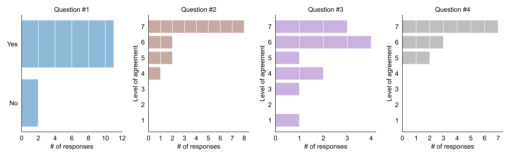

> Announcement: We are preparing for Term 1B, 2025. See branch 2024 for the previous year course materials. 

## Contents

- [About](#about) | [Timeline](#timeline-and-location) | [Schedule](#approximate-schedule) | [Learning outcomes](#intended-learning-outcomes)
- [First-run results](#first-run-results)
- [Classes](#classes)
    - [Class #1: What is materials informatics + Python crash course](#1)
    - [Class #2: Python libraries for atomistic modelling of materials](#2) 
    - [Class #3: Data in materials science](#3)
    - [Class #4: Data exploration, visualization, and fitting](#4)
    - [Class #5: Classical ML for materials science pt.1](#5)
    - [Class #6: Classical ML for materials science pt.2](#6)
    - [Class #7: Graph neural networks for materials science pt.1](#7)
    - [Class #8: Graph neural networks for materials science pt.2](#8)
    - [Class #9: Machine learning for molecular simulation](#9)
    - [Class #10: Critical reviews of scientific papers](#10)
    - [Class #11: Working on final projects in class](#11)
    - [Class #12: Final project presentations](#12)
- [Assessment criteria](#assessment-criteria) 
- [Final project description](#final-project-description)
- [Data used](#data)
- [List of resources related to materials informatics](#list-of-resources-related-to-materials-informatics)
- [References](#references-materials-inspiration)

 

## About

The course is an overview of data-driven techniques for accelerating materials design with a focus on the atomistic scale and inorganic compounds. In general, each lecture is a short overview + minimum required theory. The seminars are the main part of the course. During the course we will: learn Python libraries for atomistic materials modelling, get an overview of materials science databases and learn how to use the Materials project API, apply machine learning algorithms to predict materials properties, and perform molecular dynamics simulations with deep learning interatomic potentials. 

It is expected that students will better understand the concepts through learning by doing. At the end of the course, students will present a final project in the form of an article based on the homework they have completed.

The course is developed by Artem Dembitskiy under the supervision of Prof. Dmitry Aksenov at the Skolkovo Institute of Science and Technology.

### Timeline and location

Term 1B, Sept. 29 - Oct. 24, MON 16:00-19:00, THU FRI 12:30-15:30

### (Approximate) Schedule

 Click to open

* Week #1 (easy/medium)
    * What is materials informatics? 
    * Python for atomistic modeling of materials
    * Data in materials science
* Week #2 (medium)
    * Exploratory data analysis
    * Classical ML for materials science pt.1
    * Classical ML for materials science pt.2
* Week #3 (hard)
    * Graph neural networks for materials science pt.1
    * Graph neural networks for materials science pt.2
    * Machine learning for molecular simulation
* Week #4 (easy)
    * Working on final projects in class
    * Critical reviews of scientific journal articles
    * Final projects presentation

### Intended learning outcomes
On completion of the course you will be able to:

- Apply python libraries and data science tools to solve materials science problems
- Critically evaluate materials informatics literature
- Collect, generate and analyse materials science datasets, including identification of structure-property relationships

### Course prerequisites
* Computational materials science track
* Basic knowledge of materials modeling, python (numpy, pandas), crystal chemistry, linear algebra
* Laptop

### Course navigation

This github repo contains most of the course content. Quizzes and homeworks will be announced separately in the canvas and the telegram chat.

## First-run results

 Course Evaluation Survey 

In the figure below, you can see how students responded to the questions we asked them regarding the first-run of the course.

- Question #1. Was it convenient for you to use Github for the course navigation?

- Question #2. Please rank on a 7-point scale (7 being the highest) the degree to which you think you achieved the learning outcome "Apply python libraries and data science tools to solve materials science problems"

- Question #3. Please rank on a 7-point scale (7 being the highest) the degree to which you think you achieved the learning outcome "Critically evaluate materials informatics literature"

- Question #4. Please rank on a 7-point scale (7 being the highest) the degree to which you think you achieved the learning outcome "Collect, generate and analyse materials science datasets, including identification of structure-property relationships"

The questionnaire was adapted from [Using Jupyter Tools to Design an Interactive Textbook to Guide Undergraduate Research in Materials Informatics](https://pubs.acs.org/doi/10.1021/acs.jchemed.2c00640)

## Classes

Each class consists of a relatively short lecture and a relatively long (coding) seminar. All class materials are stored in the [lectures](lectures) and [seminars](seminars) folders. Each class begins with "Previously on...", "Class Goals" and "Agenda" and ends with a "Take Home Message".

| Class | Lecture | Seminar | Homework | Supplementary materials |
|------|----------|----------|----------|-------|
|<a id="1">1</a>.   (Date: Sep. 29)| [Lecture 1](lectures/lecture01_Intro+Navigation.pdf)  Agenda: Materials informatics overview. Motivation, navigation. ILOs and assessment. HWs and FP description.| [Seminar 1](seminars/seminar01_Python_Crash_Course.ipynb)  Agenda: Google Colab, reminder of the key libraries used in science: numpy, pandas, scipy, matplotlib.| HW1   Agenda: Python basics, numpy, pandas, scipy, matplotlib. Python for atomistic modeling. The Materials project API  Deadline: Oct., 10, 2024, 15:59 MSK |   |
|<a id="2">2</a>   (Date: Oct. 1)| [Lecture 2](lectures/lecture02_Python_for_materials_modeling.pdf)   Agenda: Python in materials science.|[Seminar 2](seminars/seminar02_Intro_to_ASE_and_Pymatgen.ipynb)    Agenda: The ASE and Pymatgen python libraries. Molecules and crystals. Various text formats of a material representation. Local coordination, nearest neighbors list building, Voronoi partitioning, translational symmetry.|       |  [ASE: tips and tricks](https://wiki.fysik.dtu.dk/ase/tips.html), [Pymatgen tutorials](https://github.com/materialsvirtuallab/matgenb/tree/master/notebooks) |
|<a id="3">3</a>   (Date: Oct. 3)| [Lecture 3](lectures/lecture03_Data_in_materials_science.pdf)   Agenda: Data in materials science. FAIR principles. The Materials Project and its API.|Seminar 3   Agenda: The Materials Project's API, phase diagrams in Pymatgen.|       |  [Paper: FAIR](https://www.nature.com/articles/sdata201618), [Paper: MP](https://pubs.aip.org/aip/apm/article/1/1/011002/119685/Commentary-The-Materials-Project-A-materials), [The MP API: Getting started](https://docs.materialsproject.org/downloading-data/using-the-api/getting-started) |
|<a id="4">4</a>   (Date: Oct. 6)| [Lecture 4](lectures/lecture04_Exploratory_data_analysis.pdf)   Agenda: Exploratory data analysis.|[Seminar 4](seminars/seminar04_EDA.ipynb)   Agenda: scipy, matplotlib, pandas, EDA|       |  [Lecture from CS 109a course by Pavlos Protopapas & Kevin Rader](https://harvard-iacs.github.io/2018-CS109A/lectures/lecture-3/presentation/lecture3.pdf)    |
|<a id="5">5</a>   (Date: Oct. 8)| [Lecture 5](lectures/lecture05_ML_for_material_science_pt1.pdf)   Agenda: ML for materials science. Types of tasks. Property and descriptor. Linear regression. Loss function. Gradient descent. |[Seminar 5](seminars/seminar05_Regression.ipynb)     Agenda: scikit-learn python library, regression models for properties of materials. HW1 review.|HW2   Agenda: sklearn, regression, hardness prediction, feature importances and feature selection, molecular dynamics simulation using universal interatomic potentials.   Deadline: Oct., 21, 2024, 15:59 MSK FP announcement.  Deadline: Oct., 25, 2024, 23:59 MSK|  [Paper](https://www.nature.com/articles/s41524-019-0221-0#Abs1)   |
|<a id="6">6</a>   (Date: Oct. 10)| [Lecture 6](lectures/lecture06_ML_for_material_science_pt2.pdf)   Agenda:  Feature design in materials science. Geometrical and compositional features. Hierarchy of the crystal structure descriptors. Crystal structure fingerprint. Feature importance|[Seminar 6](seminars/seminar06_Features.ipynb)    Agenda: Feature importance, matminer python library.|    |  [Paper](https://journals.aps.org/prb/abstract/10.1103/PhysRevB.96.024104)   |
|<a id="7">7</a>   (Date: Oct. 13)| [Lecture 7](lectures/lecture07_Intro_to_Neural_Networks.pdf)   Agenda: Logistic regression. Neural networks. Backpropagation. |[Seminar 7](seminars/seminar07_LogReg_and_MLP.ipynb)    Agenda: Intro to PyTorch, training loop, metal/insulator classification  |HW3  Agenda: Paper review   Deadline: Oct., XX, 2024, 15:59 MSK  | [Paper](https://journals.aps.org/prl/abstract/10.1103/PhysRevLett.120.145301)    |
|<a id="8">8</a>   (Date: Oct. 15)| Lecture 8   Agenda: Graph representation of materials. Crystal Graph Convolutional Neural Networks (CGCNN). How to deal with periodicity. Message passing. Invariance and Equivariance. E(3)-equivariant graph neural networks. |Seminar 8   Agenda: pytorch_geometric, formation energy prediction.|    |  
|<a id="9">9</a>   (Date: Oct. 17)| Lecture 9   Agenda: Machine learning for molecular simulation. Interatomic potential. Energy and forces. Molecular dynamics employing GNNs. Active learning. Universal potentials.|Seminar 9   Agenda: Universal potentials for molecular dynamics simulation of Li-ion diffusion in Li3PS4.  HW2 review.|| [Paper](https://pubs.acs.org/doi/10.1021/acs.jctc.4c00190)    |
|<a id="10">10</a>   (Date: Oct. 20)| Lecture 10   Agenda: Students present their critical reviews of materials informatics articles (oral presentations)|Seminar 10   Agenda: Continuation of the lecture|    |     |[Paper](https://www.nature.com/articles/s41467-022-29939-5)   |
|<a id="11">11</a>   (Date: Oct. 22)| Lecture 11   Agenda: The course wrap up. Tips to complete a final project. Formulation of the problem. Data collection/analysis. Data splitting. Feature design. Model selection. Results analysis. Common mistakes, good and bad practices in employing ML for materials science.|Seminar 11   Agenda: Working on final projects|    |     |
|<a id="12">12</a>   (Date: Oct. 24)| Lecture 12   Agenda: Final projects presentations|Seminar 12   Agenda: Final projects presentation|    |     |

### Assessment criteria
* Attendance    0%
* Quizzes       10% 
* HW            45%
* Final project 35%
* * Written report 50%
* * Oral presentation 40-50%
* * Discussion of other projects 0-10%
* Peer reviews  10 %

## Final project description

 Example 

The task is to carry out a 'small' high throughput screening of solid state electrolytes conducting a given ion (Li+, Na+, K+ etc) using data driven techniques and tools covered (or beyond) during the course.

* Given a set of chemical elements
* Formulate selection criteria for high-throughput screening of solid-state electrolytes for all-solid-state Li-ion batteries.
* Download the data from the Materials Project database according to the formulated criteria.
* Calculate the band gap of the selected materials (assuming that you do not have this data deposited at the Materials Project) using at least one classical ML and GNN model and evaluate their performance. For ML model calculate crystal structure descriptors using your own featurizer or open-source tools. Perform feature importance study.
* Select one of the most promising materials and perform a diffusion simulation using your favourite universal interatomic potential.
* Calculate the activation barrier of the mobile ion and its diffusion coefficient
* Compare your materials with existing alternatives
* Write a 3-5 page article style report including
    * Introduction
    * Methods
    * Results
    * Discussion
    * Conclusion
    * Bibliography
* Prepare a 7 minutes oral presentation

### Recommended literature
- Books
    - Materials Informatics and Catalysts Informatics: An Introduction, Keisuke Takahashi, Lauren Takahashi, 2024, ISBN-10: 981970216X
    - Deep Learning, Ian Goodfellow and Yoshua Bengio and Aaron Courville, 2016, MIT Press, https://www.deeplearningbook.org/
- Papers
    - Recent advances and applications of machine learning in solid-state materials science., Schmidt, J., Marques, M.R.G., Botti, S. et al., npj Comput Mater 5, 83 (2019). https://doi.org/10.1038/s41524-019-0221-0

### Data

Data used for seminars and homeworks

|Name      |Description |Source     |
|----------|------------|-----------|
|[Li-ion conductivity dataset](seminars/seminar04/data/LiIonDatabase_poisoned.csv)          |The dataset of experimentally measured Li-ion conductivities in crystal (and amorphous) ceramics. The data includes crystal structure family, chemical family, chemical composition, target property, temperature of measurements, and source of the data. The data is poisoned with None values and outliers. The task for the students is to clean the dataset and perform exploratory data analsysis.         |   Hargreaves, C.J., Gaultois, M.W., Daniels, L.M. et al. A database of experimentally measured lithium solid electrolyte conductivities evaluated with machine learning. npj Comput Mater 9, 9 (2023). https://doi.org/10.1038/s41524-022-00951-z        |
|[The Materials project band gap dataset](seminars/seminar04/data/mp_eg_data.csv)| The dataset of a band gap values calculated using density functional theory for crystal structures. The task for students is to perform the exploratory data analysis, find the correlation between band gap value and average electronegativity of the structure| [The Materials project](https://next-gen.materialsproject.org/) API was used to retrieve the data.|
|[Double perovskite oxides band gap dataset](seminars/seminar05/data/eg_double_perovskites.csv)|The dataset consists of the band gap targets calculates with density functional theory and the elemental and geometrical descriptors of the crystal structures. The task for the students is to perform exploratory data analysis, find the correlations between the target and descriptors, optimize hyperparametrs of the regression models conduct the feature selection and feature importance study.|Talapatra, A., Uberuaga, B.P., Stanek, C.R. et al. Band gap predictions of double perovskite oxides using machine learning. Commun Mater 4, 46 (2023). https://doi.org/10.1038/s43246-023-00373-4|
|[Hardness dataset](homeworks/hw2/data/train.dat)|The dataset of expeimentally measured hardness of materials. The data is used for HW2 on supervised machine learning|Tantardini, Christian, et al. "Material hardness descriptor derived by symbolic regression." Journal of Computational Science 82 (2024): 10240, [repo](https://github.com/AlexanderKvashnin/SISSO_hardness/blob/main/train.dat)|

### List of resources related to materials informatics

#### Databases
- [The Materials project database](https://next-gen.materialsproject.org/)   
The most popular database of crystal structures and their properties calculated with density functional theory (DFT)

- [AFLOW](https://www.aflowlib.org/)  
A database of material compounds and DFT calculated properties
- [OQMD](https://oqmd.org/)  
A database of DFT calculated thermodynamic and structural properties of materials

#### Datasets

- [A polymer dataset](https://datadryad.org/stash/dataset/doi:10.5061/dryad.5ht3n)  
Structures, atomization energies, band gaps, and dielectric constants of 1k polymers.

- [SISSO hardness](https://github.com/AlexanderKvashnin/SISSO_hardness/blob/main/train.dat)   
A dataset of experimentally measured hardness of 61 material.

- [QM9](https://springernature.figshare.com/collections/Quantum_chemistry_structures_and_properties_of_134_kilo_molecules/978904/4)  
DFT calculated properties for 134k stable small organic molecules made up of CHONF.
- [Li-ion conductivities](https://pcwww.liv.ac.uk/~msd30/lmds/LiIonDatabase.html)   
An experimentally measured Li-ion conductivity dataset of 2k solids.
- [Double perovskite oxides band gap dataset](https://www.nature.com/articles/s43246-023-00373-4#MOESM4)  
A dataset of 5k band gap energies calculated with DFT for double perovskites.

#### Curated lists
- [Awesome Materials Informatics](https://github.com/tilde-lab/awesome-materials-informatics?tab=readme-ov-file)    
A list of known efforts in materials informatics.

- [Geometric GNNs](https://github.com/AlexDuvalinho/geometric-gnns)   
A list of geometric graph neural networks for atomistic modeling.

- [Best of Atomistic Machine Learning](https://github.com/JuDFTteam/best-of-atomistic-machine-learning?tab=readme-ov-file#datasets)  
A list with 430 open-source projects grouped into 22 categories.

- [Neural Network Models for Chemistry](https://github.com/Eipgen/Neural-Network-Models-for-Chemistry/tree/main)  
A collection of Neural Network Models for chemistry.

#### Software

- [ASE](https://wiki.fysik.dtu.dk/ase/)  
A python library for setting up, steering, and analyzing atomistic simulations. 

- [Pymatgen](https://pymatgen.org/)  
A python library for atomic structures analysis

- [matminer](https://hackingmaterials.lbl.gov/matminer/)  
A python library for data mining the properties of materials

- [DScribe](https://singroup.github.io/dscribe/latest/)  
A python package for transforming atomic structures into fixed-size numerical fingerprints

- [TorchSISSO](https://github.com/PaulsonLab/TorchSISSO)  
A PyTorch-Based Implementation of the Sure Independence Screening and Sparsifying Operator (SISSO) for Efficient and Interpretable Model Discovery

#### Tutorials
- [Pymatgen tutorials](https://github.com/materialsvirtuallab/matgenb/tree/master/notebooks)  
Various tutorials on how to use pymatgen, the python library for atomistic materials modeling and post-processing of the density functional theory calculations.

- [Matminer examples](https://github.com/hackingmaterials/matminer_examples/tree/main/matminer_examples)  
Tutorials on how to use matminer, the python library for encoding atomic structures (i.e. generating atomic structure descriptors).

#### Universal machine learning interatomic potentials

- [SevenNet](https://github.com/MDIL-SNU/SevenNet)  
A graph neural network interatomic potential package supporting efficient multi-GPU parallel molecular dynamics simulations.

- [MACE_MP](https://github.com/ACEsuit/mace-mp)  
Pre-trained foundation models for materials chemistry, parameterised for 89 chemical elements.

- [CHGNet](https://chgnet.lbl.gov/)  
A pretrained universal neural network potential for charge-informed atomistic modeling.

- [M3GNet](https://matgl.ai/#m3gnet)  
A universal graph deep learning interatomic potential for the periodic table. Note: this potential is trained on a smaller dataset. 

### Acknowledgement

We would like to thank:
- [Andrey Geondzhian](https://github.com/geonda) for giving a talk on neural networks for materials science (Oct. 2024) 
- [Innokentiy Humonen](https://github.com/IHumonen) for giving a talk on equivariant graph neural networks for materials science (Oct. 2024)

### References, materials, inspiration
- [Machine learning](https://github.com/dzisandy/Machine-Learning) by Evgeny Burnaev 
- [Introduction to materials informatics](https://enze-chen.github.io/mi-book-2021/intro.html)  by Mark Asta and Enze Chen
- [Materials informatics](https://github.com/sp8rks/MaterialsInformatics/tree/main) by Taylor Sparks
- [Single-lecture introduction to materials informatics](https://github.com/eddotman/intro-to-materials-informatics) by Edward Kim

### Typos, mistakes, suggestions, comments

If you have any ideas/comments on how to improve the content of the course, or have found any typos and mistakes, don't hesitate to create a github issue.

