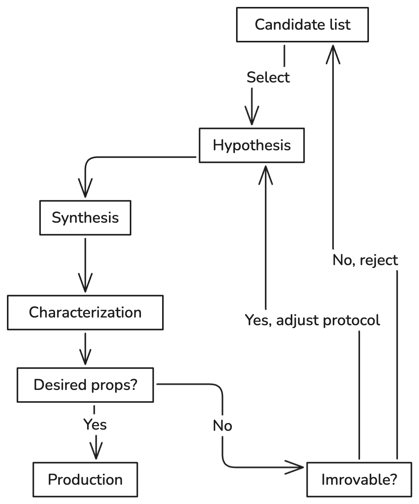
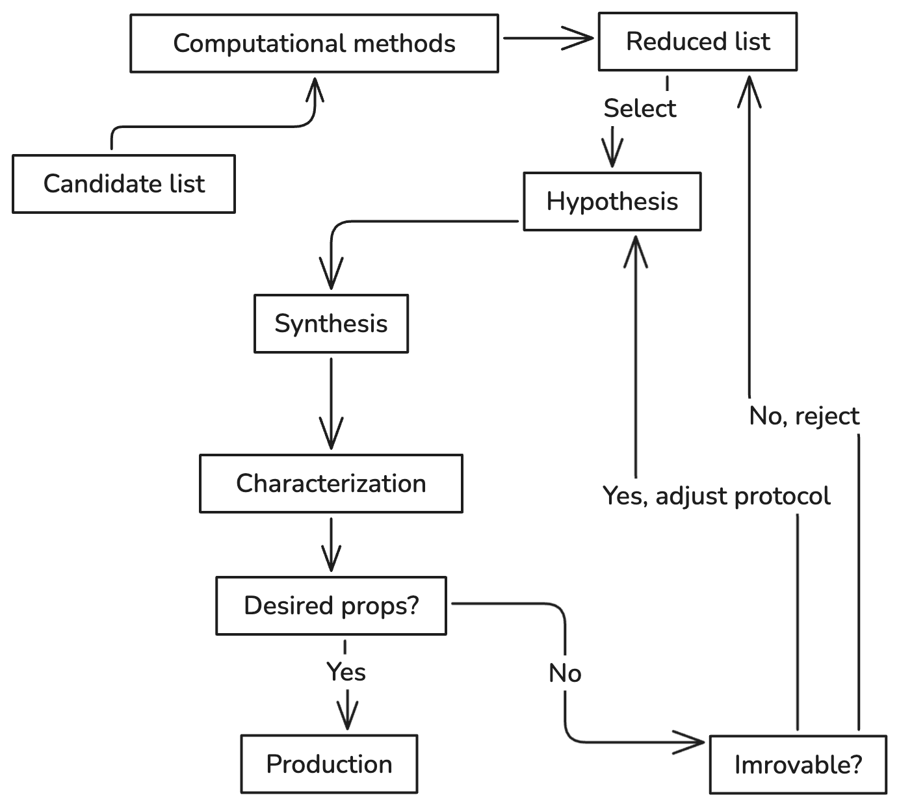

## Lecture #1: What is materials informatics + Course Navigation

<footer>Slides by <a href="https://github.com/dembart">Artem Dembitskiy</a> </footer>

---
## Goals
- Provide an understanding of what materials science and materials informatics  are 
- Describe the course content
- Help students decide if the course is right for them
---

## Agenda
- Goals
- What is materials informatics? 
  - Materials science
  - Scales 
  - Experiment vs. Theory
  - Materials informatics
  - Examples
- Course navigation
  - ILOs, HW, FP, assessement criteria
---

## Materials science (and engineering)
- studies the relationship between the structure and properties of a material

-  and uses this knowledge to improve our lives

--- 

<footer> Image <a href="https://sustainable-nano.com/wp-content/uploads/2014/02/5-diamond-vs-graphite-structures.jpg">source</a> </footer>

___

### Tasks that materials science solves:

- Design
- Imrove
- Understand reasons of a failure
...

___

### Design
  - New material
  - With specified properties
  - Stable at given conditions

<!--examples: blue diode, Li-ion battery, nuclear bomb, extreme conditions-->

<footer> Image <a href="https://www.lanl.gov/projects/future/_assets/images/1663.jpg">source</a> </footer>

---

### Improve
  - Better props
  - Less expensive
  - Easier to process

<!--examples: higher capacity, lighter plane, harder drill, alternative synthesis -->

<footer> Image <a href="https://www.viridiansolar.co.uk/assets/images/all-about-solar/pv-cell-efficiency-record.jpg">source</a> </footer>

___

### Understand reasons of a failure
- Why?
- When?
- Can be fixed?

<footer>  Intragranular cracking as a critical barrier for high-voltage usage of layer-structured cathode for  <a href="https://www.nature.com/articles/ncomms14101/figures/2">lithium-ion batteries</a> </footer>

___

### The materials are characterized
...at various length scales
  - atomic
  - micro
  - meso
  - macro

<footer> Image <a href="https://mm.ethz.ch/education/master-phd-studies/multiscale-modeling/_jcr_content/par/fullwidthimage/image.imageformat.930.344377523.png">source</a> </footer>

___

### The course 
...focuses on the atomic scale

...and inorganic materials

<footer> Bandgap engineering of two-dimensional <a href="https://media.springernature.com/full/springer-static/image/art%3A10.1038%2Fs41699-020-00162-4/MediaObjects/41699_2020_162_Fig1_HTML.png?as=webp">semiconductor materials</a> </footer>

___

### Trial-and-error in materials science
...is the only way to reach the goal

- Takes ~10 years to design a material

<!--https://excalidraw.com/#json=nFOxe28OOsdmKQ90x_386,pSNmIAsJzpxNOwv1nG6Bmw-->

___

### Example: Stainless steels

- 1798 - chromium discovery
- 1821 - iron-chromium alloys
- 1861 - the first patent on chromium steels
- 1911 - report on the relationship between the chromium
content and corrosion resistance

___

### Trial and error loop can be optimized
...with the help of theoretical and computational approaches

...by replacing "expensive" experiments with computation

<footer> Multiscale mechanics and molecular dynamics simulations of the durability of fiber-reinforced  <a href="https://www.nature.com/articles/s43246-023-00391-2">polymer composites</a> </footer>

___

### Example: Adsorption energy

- Determines catalytic properties
- Essential for chemical industry

<footer> Adsorption energies on transition metal surfaces: towards an accurate and balanced description  <a href="https://www.nature.com/articles/s41467-022-34507-y">accurate and balanced description </a> </footer>

___

### Computational methods
...accelerates the first stage of the materials design

<footer> High-throughput computational-experimental screening protocol for the discovery of bimetallic catalysts  <a href="https://www.nature.com/articles/s41467-022-34507-y">discovery of bimetallic catalysts </a> </footer>

___

### Trial-and-error with computational methods

- Takes ~2 years to design a material

___

## Can it be further optimized?
___

### Materials informatics
...accelerates the solution of materials science problems through the use of data

...mostly by replacing computational methods with surrogate models

<footer> Accelerating materials discovery using <a href="https://www.nature.com/articles/s41524-022-00765-z">artificial intelligence, high performance computing and robotics</a> </footer>

---

### A typical workflow
collect data -> train -> predict -> reduce candidate list -> computational methods -> reduce candidate list -> experiment 

<footer> Machine learning and evolutionary prediction of  <a href="https://www.nature.com/articles/s41524-021-00585-7">superhard B-C-N compounds</a> </footer>

---

### Scaling deep learning for materials discovery 

Statement
- 381,000 new stable materials

- 736 structures have been independently experimentally verified

<footer> Scaling deep learning for <a href="https://www.nature.com/articles/s41586-023-06735-9">materials discovery</a> </footer>

___

### Reality

Domain knowledge is essential

  - "a very poor fit

  - a different CIF has been used for refinement compared with that in the paper and in the Materials Project

  - no evidence for order, and a known disordered version of the compound exists

  - the compound is correctly identified but is already reported"

<footer> Challenges in High-Throughput Inorganic <a href="https://journals.aps.org/prxenergy/abstract/10.1103/PRXEnergy.3.011002">Materials Prediction and Autonomous Synthesis</a> </footer>

---

## Lecture #1: Course motivation and navigation
___

### Course structure
- Each class = 1h lecture + 2h seminar
- 11 lectures
- 10 seminars
- 3 HWs
- 1 FP
- 2 FP peer-reviews
- ~10 lecture recap quizzes

___

  - Class #1: What is materials informatics + Python crash course
  - Class #2: Python libraries for atomistic modelling of materials
  - Class #3: Data in materials science
  - Class #4: Data exploration, visualization, and fitting
  - Class #5: Classical ML for materials science pt.1
  - Class #6: Classical ML for materials science pt.2
  - Class #7: Graph neural networks for materials science pt.1
  - Class #8: Graph neural networks for materials science pt.2
  - Class #9: Machine learning for molecular simulation
  - Class #10: Working on final projects in class
  - Class #11: Selected topics in materials informatics
  - Class #12: Final project presentations
___

## Course materials

- The course content is stored at the github [repo](https://github.com/dembart/intro-to-materials-informatics)
- HWs are announced separately in the canvas and a telegram chat
___

### FP example: High throughput screening of solid state electrolytes for Li-ion batteries

* Formulate selection criteria
* Download the data from the database
* Predict the band gap. Predict the ionic conductivity. Perform feature importance study.
* Perform a diffusion simulation study of the best candidate using your favourite universal interatomic potential.
* Write a 3 page article style report
* Prepare a 5 minutes oral presentation

<footer> High-Throughput Screening of Solid-State Li-Ion Conductors Using Lattice-Dynamics Descriptors  <a href="https://www.cell.com/iscience/fulltext/S2589-0042(19)30173-7?_returnURL=https%3A%2F%2Flinkinghub.elsevier.com%2Fretrieve%2Fpii%2FS2589004219301737%3Fshowall%3Dtrue">Lattice-Dynamics Descriptors </a> </footer>

___
### You can propose your own final project if it is in line with the ILOs

---

### On completion of the course you will be able to:

- Apply python libraries and data science tools to solve materials science problems

- Critically evaluate materials informatics literature

- Collect, generate and analyse materials science datasets, including identification of structure-property relationships

___

## Why?

Modern materials science = Materials informatics
___

## Take home message

- Materials informatics accelerates the solution of materials science problems through the use of data science tools

- We focus on atomistic scale and inorganic compounds

- By the end of the course you will be able to apply data science pipelines for solving materials science problems

___

## Announcement

- HW1 is released
- HW1 deadline is Thursday, October 10th at 11.59 pm
- The deadline is strict
- Topics covered in HW1 (the first 4 lectures/seminars):
  - python for science: numpy, pandas, scipy, matplotlib
  - python for materials modeling: ase, pymatgen
  - python for materials informatics: mp_api - the Materials project API
  - exploratory data analysis

___

### Resources

https://github.com/tilde-lab/awesome-materials-informatics

https://github.com/anthony-wang/BestPractices

https://github.com/sp8rks/MaterialsInformatics

https://github.com/ncfrey/resources

https://github.com/eddotman/intro-to-materials-informatics

https://enze-chen.github.io/mi-book-2021/intro.html

