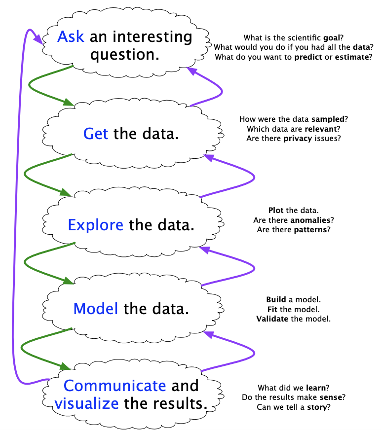
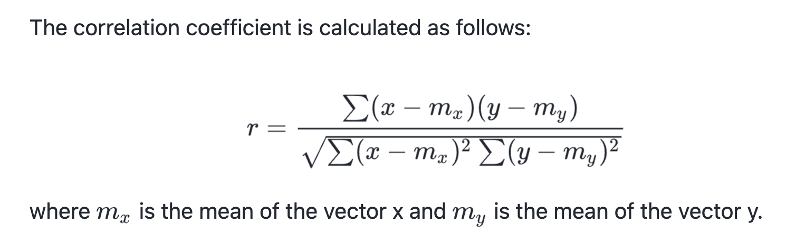
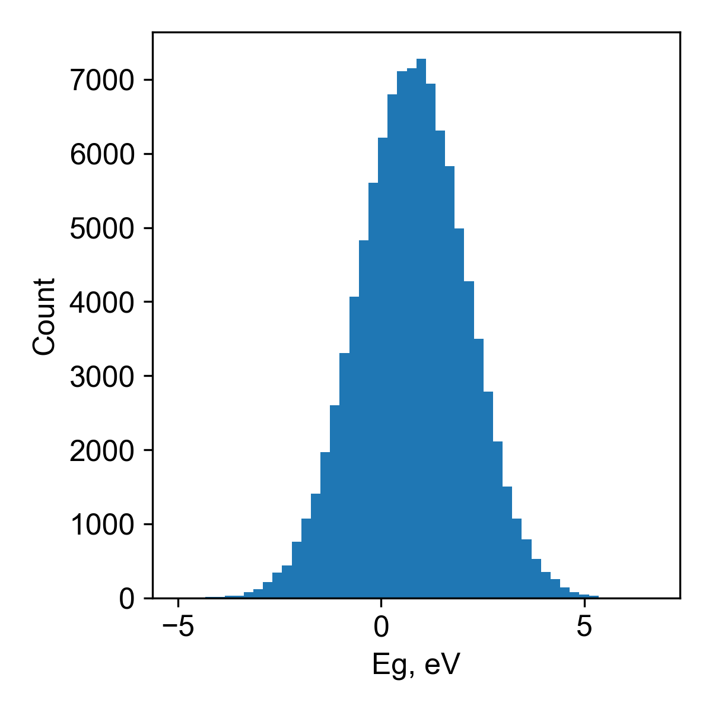
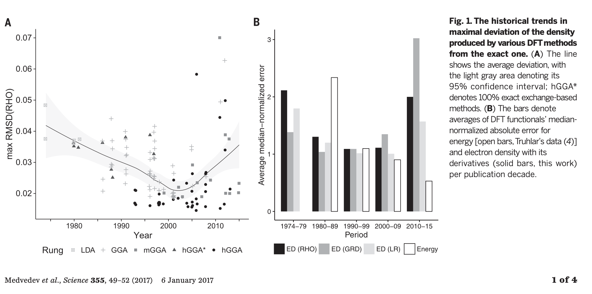
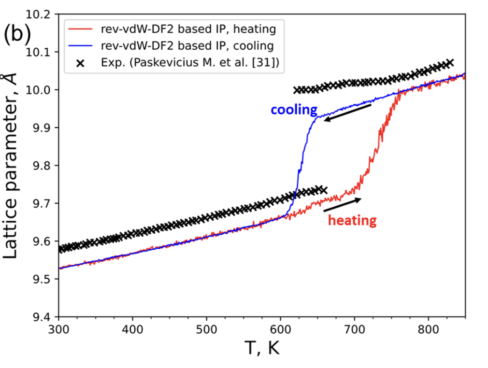
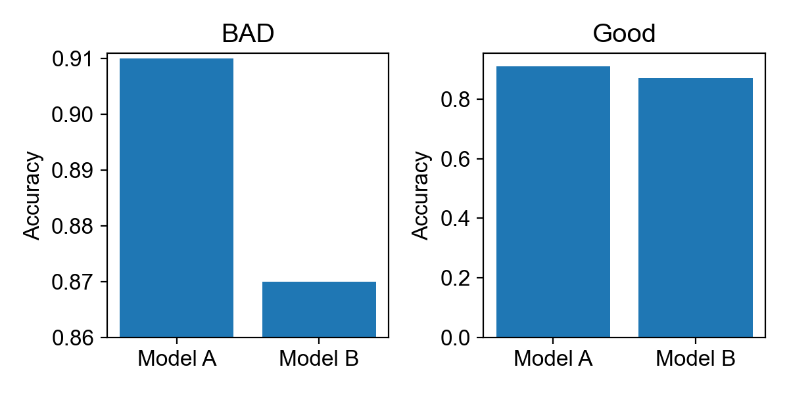
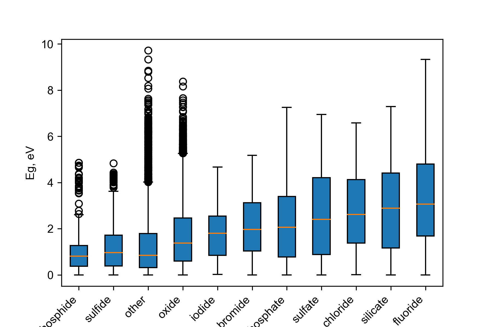
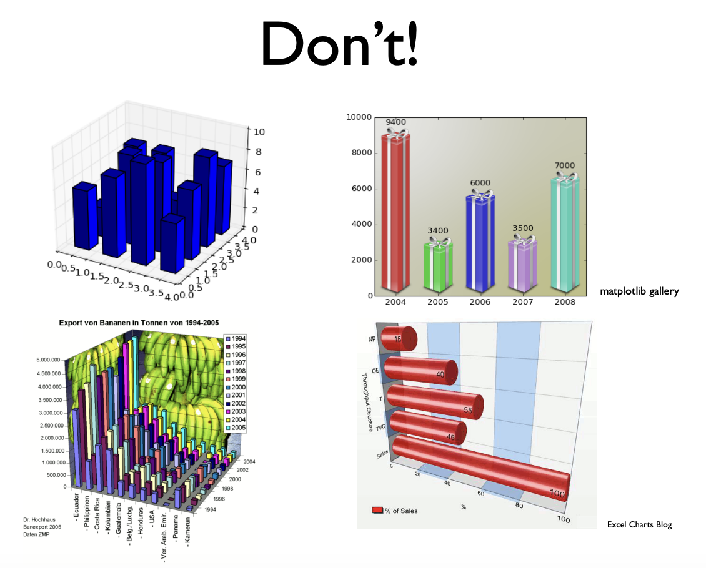

## Lecture #4: Exploratory data analysis (EDA)

<footer>Slides by <a href="https://github.com/dembart">Artem Dembitskiy</a></footer>


---
### Previously on

- Python for atomistic modeling
  - ASE's Atoms and Pymatgen's Structure
  - Neighbor list
  - Voronoi partitioning
- Data in materials informatics
  - Computational data
  - The Materials project API

---
### Goals/Agenda

- Explain why visualizing data is important when analyzing data
- Provide tips on how to use visualization to explore data

---

### Attribution

- Parts of these slides are adopted from the excellent lecture on exploratory data analsysis from the course CS 109A: Introduction to Data Science by Pavlos Protopapas & Kevin Rader shared under MIT licence

  - https://harvard-iacs.github.io/2018-CS109A/lectures/lecture-3/presentation/lecture3.pdf

- Consider the following materials your reading homework
---
### The data science workflow




<footer>From CS 109a: Data Science,
Effective Exploratory Data
Analysis and Visualization by Pavlos Protopapas & Kevin Rader<a href="https://harvard-iacs.github.io/2018-CS109A/lectures/lecture-3/presentation/lecture3.pdf"> slide #2</a></footer>

---
### Descriptive statistics 

"...is a summary statistic that quantitatively describes or summarizes features from a collection of information"

https://en.wikipedia.org/wiki/Descriptive_statistics


---
### Sample size

Number of observations in a dataset (study)

```python
len(data)
```

---

### Mean
<style scoped>section{font-size:24px;}</style>

```python
np.mean(data)
```


---
<style scoped>section{font-size:24px;}</style>

### Median

```python
np.median(data)
```


"The median of a set of numbers is the value separating the higher half from the lower half of a data sample, a population, or a probability distribution."


---
<style scoped>section{font-size:24px;}</style>

### Standard deviation

"...is a measure of the amount of variation of the values of a variable about its mean."


---
<style scoped>section{font-size:24px;}</style>

### Correlation coefficient

[The Pearson correlation coefficient](https://en.wikipedia.org/wiki/"Pearson_correlation_coefficient) measures the linear relationship between two datasets. Like other correlation coefficients, this one varies between -1 and +1 with 0 implying no correlation."

[scipy docs](https://docs.scipy.org/doc/scipy/reference/generated/scipy.stats.pearsonr.html#r8c6348c62346-1)




---
### Descriptive statistics of band gap (Eg) distribution in the Materials Project

- Sample size
  - 103,217
- Mean of Eg
  - 0.79
- Standard deviation of Eg:  
  - 1.37

---
### Is it what you expected?
- What's wrong with this distribution?


---
### Any ideas?
- Sample size
  - 103,217
- Median of Eg: 
  - 0.0 <--- ???

---
### This is the real distribution

-  Metals have a zero Eg


> Median(Eg) = 0.0 says that metals represent at least half of the sample
---
### Why is visual inspection of data important?

- Same descriptive statistics
- Very different distributions


https://en.wikipedia.org/wiki/Anscombe%27s_quartet


---
### Visulaization goals

<style scoped>section{font-size:24px;}</style>


Communicate (Explanatory)
- Present data and ideas
- Explain and inform
- Provide evidence and support
- Influence and persuade

Analyze (Exploratory)
- Explore the data
- Assess a situation
- Determine how to proceed
- Decide what to do


<footer> From CS 109a: Data Science,
Effective Exploratory Data
Analysis and Visualization by Pavlos Protopapas & Kevin Rader<a href="https://harvard-iacs.github.io/2018-CS109A/lectures/lecture-3/presentation/lecture3.pdf"> slide #23</a></footer>

---
<style scoped>section{font-size:24px;}</style>

### Communicate 



<footer>Density functional theory is straying from the path toward<a href="https://www.science.org/doi/10.1126/science.aah5975"> the exact functional</a></footer>


---
### Explore
<style scoped>section{font-size:24px;}</style>




<footer>Order–Disorder Phase Transition and Ionic Conductivity in a<a href="https://pubs.acs.org/doi/10.1021/acsami.3c07242"> Li2B12H12 Solid Electrolyte</a></footer>

---


### Exploratory data analysis pipeline

- Build data 
- Clean data
- Explore global features
- Explore group features
---

### Build (read) data in a structured format 
  - Pandas DataFrame
  - One row per variable

```python
df = pd.read_csv('eg_data.csv')
```
---

### Clean the data
  - outliers
  - NaNs (missing values)
  - constant rows
  - duplicates
```python
df.dropna()
```
- plus visual support: histogram, box plot

--- 

### Study the global summary statistics
```python
df.describe()
```

```python
df.aggregate(
                {
                "column_name": ["min", "max", "median", "skew"]
                }
)
```
- plus visual support: histogram, scatter plot, bar plot
---

### Study the summary statistics of the subgroups

```python
df[["bandgap, chemsys"]].groupby("chemsys").mean()
```
- plus visual support: histogram, scatter plot, bar plot

---

## Some principles for effective EDA

---
### Avoid misleading graphs

- Do not distort scales
- Do not truncate graph when comparing the data
  -  or indicate the truncation
- Avoid 3D charts
- Do not change y(or x)-axis maximum 
- Aspect ratio determines the perception of steepness in [slope](https://graphworkflow.com/enhancement/aspect/)
  - be proportional

Have a look at this page: https://en.wikipedia.org/wiki/Misleading_graph

---
<style scoped>section{font-size:24px;}</style>
### Lie factor



---
<style scoped>section{font-size:20px;}</style>

### Use the right display 


---

### Correlations

- scatter plot, correlation matrix


**Is it a good graph? Why?**

<footer>Design principles for NASICON  <a href="https://www.nature.com/articles/s41467-023-40669-0"> super-ionic conductors</a></footer>

---
### Distribution

- histogram, density plot

**Is it a good graph? Why?**


---
### Comparison

- bar plot, box plot

**Is it a good graph? Why?**




---
### Box plot


---

# Don't use pie charts

Barplots are easier to compare


<footer>Here’s why you should (almost) never use a pie chart <a href="https://theconversation.com/heres-why-you-should-almost-never-use-a-pie-chart-for-your-data-214576"> for your data</a></footer>


---
<style scoped>section{font-size:22px;}</style>

### Use color


Have a look at this page: https://blog.datawrapper.de/colors/

---
<style scoped>section{font-size:22px;}</style>

### But consider a better alternative if possible

- the simpler the better


Have a look at this page: https://blog.datawrapper.de/colors/

---
<style scoped>section{font-size:20px;}</style>
#### My favorite



<footer>From CS 109a: Data Science,
Effective Exploratory Data
Analysis and Visualization by Pavlos Protopapas & Kevin Rader<a href="https://harvard-iacs.github.io/2018-CS109A/lectures/lecture-3/presentation/lecture3.pdf"> slide #55</a></footer>

---

### Take home message

- Visualizing data helps you
  - Present data and ideas
  - Analyze results
  - Define future steps

- The data is more important than the design
  - Represent the data in a right way
  - Avoid misleading graphs

---
### Resources:

https://harvard-iacs.github.io/2018-CS109A/lectures/lecture-3/presentation/lecture3.pdf

https://en.wikipedia.org/wiki/Misleading_graph

https://en.wikipedia.org/wiki/Anscombe%27s_quartet

https://blog.datawrapper.de/colors/


---

# Thank you for your attention!


