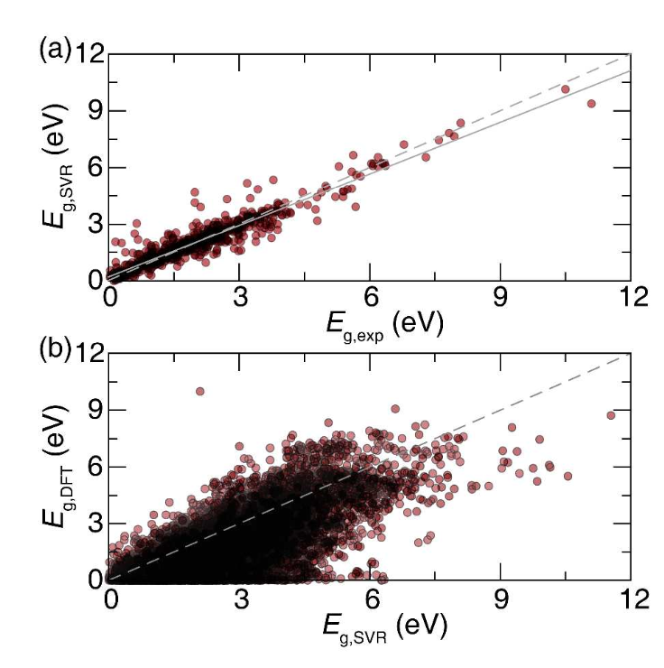
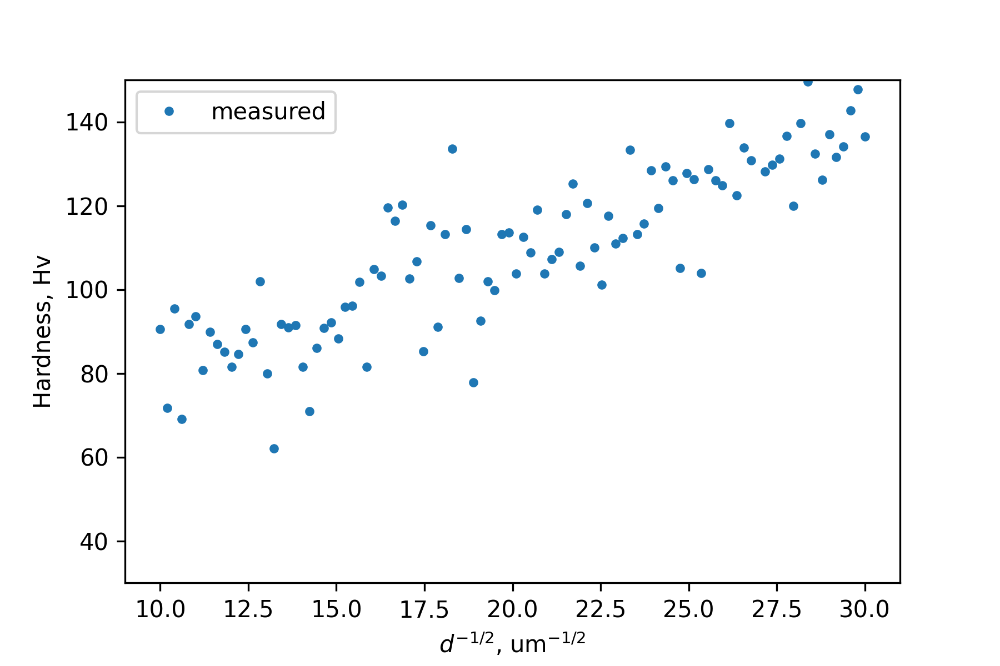
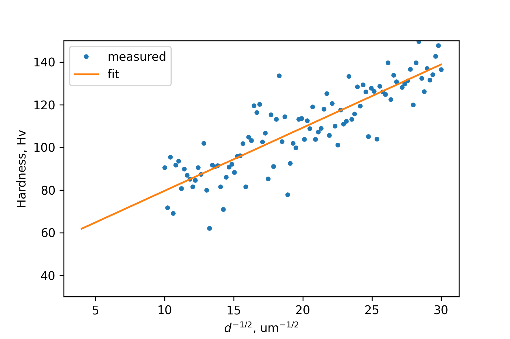
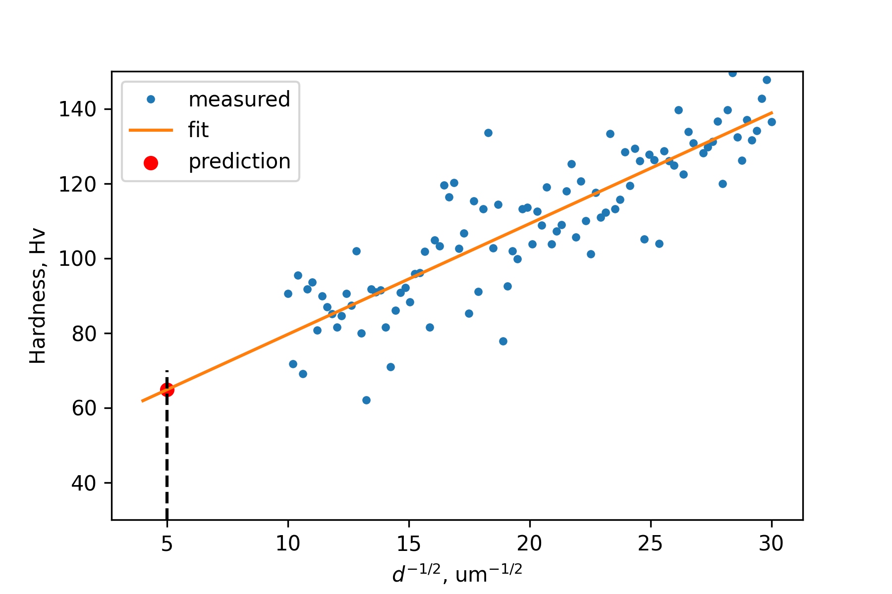
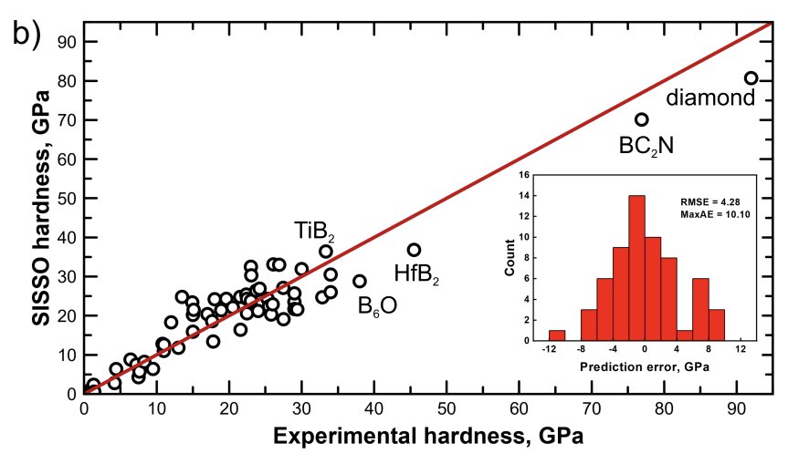
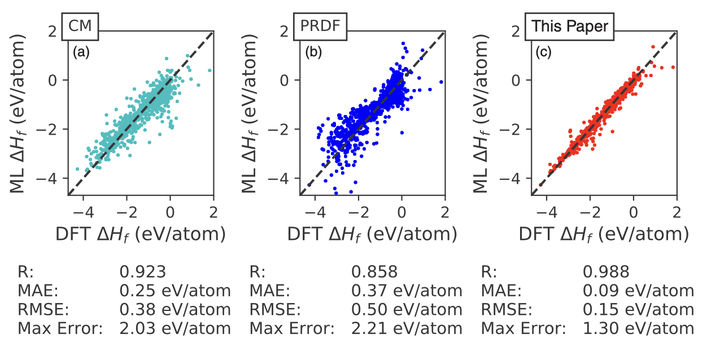
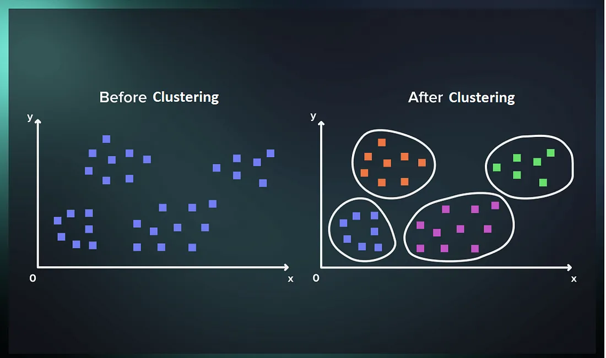
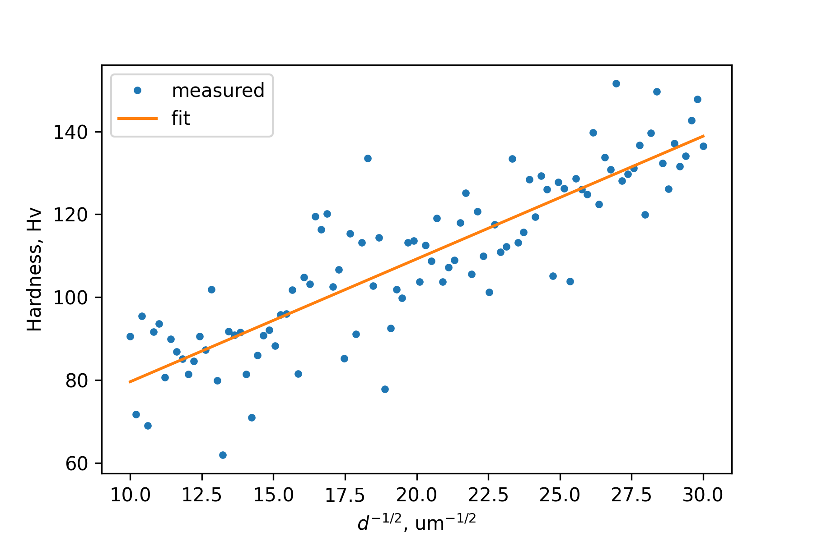

## Lecture #5: Machine learning for materials sience pt. 1
<footer>Slides by <a href="https://github.com/dembart">Artem Dembitskiy</a></footer>

---

### Course roadmap

  - Class #1: What is materials informatics
    - Trial-and-error paradigm
    - Python crash course
  - Class #2: Python libraries for atomistic modelling of materials
    - ASE, Pymatgen
    - NN list
  - Class #3: Data in materials science
    - The Materials project
    - Phase diagrams
  - Class #4: Data exploration, visualization, and fitting
    - $E_g$ vs. electronegativity
    - Ionic conductivity
---
### Goals

- Overview of materials science problems solved with ML
- Overview of selected regression models
- Learn how to train and evaluate the model

---

### Lecture overview

- ML tasks
- Why and when use ML?
- Property and descriptor
- Linear regression
- Cost function
- Ridge regression
- Gradient descent
- Decision tree and Random Forest
- Model evaluation

---

### Why use ML? 

- "Machine learning algorithms aim to optimize the performance of a certain task by using examples and/or past experience."*

- "Study of statistical algorithms that can learn from data and generalize to unseen data, and thus perform tasks without explicit instructions" (wiki)

- Machine learning accelerates materials design by efficiently learning the structure-property relationship from data to predict unknown properties with minimal experimental or computational effort

<footer>*Recent advances and applications of machine learning in  <a href="https://www.nature.com/articles/s41524-019-0221-0#Abs1">solid-state materials science</a></footer>

---

### Example: Band gap estimation

- Experiment (UV-Vis absorption) ~1 week

  - synthesis
  - several measurements
  - equipment required
- DFT HSE ~ 1-10 days
  - crystal structure required
  - computationally expensive

<footer>Image <a href="https://nirajchawake.wordpress.com/2014/10/20/semiconductors-why-%E2%88%86e%E2%89%A43-2-ev/">source</a></footer>

---

### What if we have 10,000 candidates? 

How many years would it take to find the best material?

---

### Surrogate model

  - takes < 1 second to predict the property
  - trained on existing data
  - chemical composition only
  - simple laptop is sufficient

SVR - Support Vector Regression

  

<footer>Predicting the Band Gaps of Inorganic Solids by  <a href="https://pubs.acs.org/doi/10.1021/acs.jpclett.8b00124">Machine Learning</a></footer>

---
### Limitations
- High quality data is required to fit the model
- Accuracy is good for screening stages (RMSE = 0.45 eV)
  - but poor for a more specific tasks

**There is a trade off between speed and accuracy**

---

# (Classical) ML tasks

---

<footer>Machine Learning for Everyone.<a href="https://vas3k.com/blog/machine_learning/"> In simple words. With real-world examples. Yes, again</a></footer>

---
### Supervised learning

"Tries to find the unknown function that connects known inputs to unknown outputs"

<footer>Recent advances and applications of machine learning in <a href="https://www.nature.com/articles/s41524-019-0221-0#Abs1">solid-state materials science </a></footer>

---
### Grain size of alloys

<footer>Image <a href="https://www.nature.com/articles/s41467-023-36030-0">source </a></footer>

---

  - input: grain size
  - output: hardness

---

Model fit:
  - input (features): grain size (known)
  - output (labels): hardness (known)

---

Model prediction:
Hardness($d^{-1/2}$ = 5 um$^{-1/2}$)? 

  - input: grain size (known)
  - output: hardness (unkown)

---
### Supervised ML for materials science (examples)

---
### Hardness

<footer>Material Hardness Descriptor Derived by <a href="https://arxiv.org/pdf/2304.12880">Symbolic
Regression  </a></footer>

---
### Band gap

<footer>Band gap predictions of double perovskite oxides using<a href="https://www.nature.com/articles/s43246-023-00373-4#MOESM4"> machine learning </a></footer>

---

### Formation energy

<footer>Including crystal structure attributes in machine learning models of formation energies via <a href="https://journals.aps.org/prb/abstract/10.1103/PhysRevB.96.024104"> Voronoi tessellations </a></footer>

---

### Self-supervised learning

... is about "finding patterns in unlabeled data"

(not taught on course)

<footer>Blog: Clustering by <a href="https://medium.com/@denizgunay/clustering-49f2894c1c95">Deniz Gunay </a></footer>

---

### Basic supervised  learning workflow

---

### Attribution

- Parts of the next slides are adopted from the Machine Learning (MA060018) course given by prof. Evgeny Burnaev at Skolkovo Institute of Science and Technology

- Consider enrolling in this course if you are interested in fundamentals of ML

Materials:
- https://github.com/dzisandy/Machine-Learning/blob/master/Lecture%20Slides/Lecture_2_Regression_handout.pdf
- https://github.com/dzisandy/Machine-Learning/blob/master/Lecture%20Slides/Lecture_5_Decision_Trees_handout.pdf

---
### (Multiple) Linear regression

---

**Data samples**: {$(\boldsymbol{x}_1, y_1),..., (\boldsymbol{x}_i, y_i),..., (\boldsymbol{x}_n, y_n)$}

$y_i$ - response variable (regressand), also called label/target/property

$\boldsymbol{x}_i = (x_{i1},...,x_{id})$ - $1$ x $d$ vector of input features (regressors), also called features/descriptors

---

Assume that relationship between $y$ and $\boldsymbol{x}$ is linear:

$\hat{f}=b + w_0x_0 + w_1x_1 + ... w_dx_d$
$\hat{f}=\boldsymbol{wx}^T + b$

$\boldsymbol{w}$ and $b$ are unknown parameters of the model

**Task**:

Find parameters of $\hat{f}$ that will minimize the error = $\frac{1}{n}\sum{^n_i||y_i - \hat{f}(\boldsymbol{x}_i)||^2}$ 

---

<footer>Image <a href="https://encord.com/glossary/mean-square-error-mse/"> source </a></footer>

---
### Loss function

$J(\boldsymbol{w}, b) = \frac{1}{n}\sum{_i^n(\boldsymbol{wx_i}^T + b - y_i)^2}$

### Optimization problem
$J(\boldsymbol{w}, b) \rightarrow{}\underset{w, b}{min}$

---

### Matrix form

$X$ = $\begin{bmatrix}
x_{11} & x_{12} & ...& x_{1d}& 1\\
x_{21} & x_{22} & ...& x_{2d}&1\\
...\\\
x_{n1} & x_{n2} & ...& x_{nd}&1
\end{bmatrix}$, $W$ = $\begin{bmatrix}
w_{1}\\
...\\\
w_{d}\\
b
\end{bmatrix}$, $Y$ = $\begin{bmatrix}
y_{1}\\
...\\
y_{n}
\end{bmatrix}$

$J(W) = \frac{1}{n}||XW - Y||^2\rightarrow{}\underset{W}{min}$ 

---

### Solution

$J(W) = \frac{1}{n}||XW - Y||^2\rightarrow{}\underset{W}{min}$ 

$\nabla{}J(W) = 0$

$X^TXW = X^TY$

$W$ = $(X^TX)^{-1}$ $X^TY$, if $X^TX$ invertible

---

$W$ = $(X^TX)^{-1}$ $X^TY$, if $X^TX$ invertible

- Will fail if there are linearly dependent $\boldsymbol{x_i}$ in $X$

- Computationally expensive if $d >> 1$, $n >> 1$

- No regularization
  - model is not robust to noise and outliers 
  - model can overfit

---

### Generalization of a model

[source](https://www.geeksforgeeks.org/underfitting-and-overfitting-in-machine-learning/)

---
### Regularization

Which model may generalize better to more points drawn from the underlying unknown distribution? 

[wiki](https://en.wikipedia.org/wiki/Regularization_(mathematics))

---

### Ridge regression

$J(\boldsymbol{w}, b) = \frac{1}{n}\sum{_i^n(\boldsymbol{wx_i}^T + b - y_i)^2} + \lambda\boldsymbol||{w}||^{2}$

$J(\boldsymbol{w}, b)  
\rightarrow{}\underset{w, b}{min}$ 

**Solution**
$W$ = $(X^TX + \lambda I)^{-1}$ $X^TY$, $(X^TX + \lambda I)^{-1}$ - always invertible

- we penalize large weights to correct overfitting

- model is more robust to noise and outliers

- the problem of near-singular $(X^TX)^{-1}$ is solved

- penalty defines the model’s bias-variance tradeoff

---

### Iterative approach to find the best fit parameters
---

### Instead of solving problem in one step

$\theta$ = $(X^TX)^{-1}$ $X^TY$

<footer>Image <a href="https://www.kaggle.com/code/vagifa/gradient-descent-mse-from-scratch
"> source </a></footer>

---

### We solve it iteratively

**Gradient descent steps**
1) (Randomly) initialize weights
2) Compute the gradient of the cost function with respect to each parameter (partial derrivatives)
3) Update the weights of the model by taking steps in the opposite direction of the model
4) Repeat steps 2 and 3 iteratively to get the best parameter for the defined model 

<footer>Gradient Descent in  <a href="https://www.geeksforgeeks.org/gradient-descent-in-linear-regression/
"> Linear Regression </a></footer>

---

### Learning rate matters

---

### Decision tree

<footer>Classification and regression   <a href="https://www.nature.com/articles/nmeth.4370"> trees </a></footer>

---

### Attributes

<footer>Image <a href="https://www.javatpoint.com/machine-learning-decision-tree-classification-algorithm"> source </a></footer>

---

### How to select splits?

- Gini

$I_G = 1 - \sum{p_i^2}$, where $p_i$ - proportion of the samples made up class $i$ for a given node
- Entropy

$E= -\sum{p_i\log{_2 p_i}}$

for all $p_i!=0$
if all samples at the node are from the same class $I_H=0$

---

**Before split**: 5 blue samples and 5 green samples

$E= -\sum{p_i\log{_2 p_i}} = -(0.5\log{_2 0.5} + 0.5\log{_2 0.5}) = 1$

**After split at $X = 1.5$**

Left branch: $E_{left} = -\log{_2 1}=0$ (all samples are blue)

Right branch: $E_{right} = \frac{1}{6}\log{_2\frac{1}{6}} + \frac{5}{6}\log{_2\frac{5}{6}} = 0.65$

$E_{split} = 0.4 * 0 + 0.6 * 0.65 = 0.39$​

Information gain = $1 - 0.39 = 0.61$

 
​
  
<footer>A Simple Explanation of <a href="https://victorzhou.com/blog/information-gain/"> Information Gain and Entropy </a></footer>

---

### Regression with decision trees

- Piecewise constant approximation

<footer>Classification and regression   <a href="https://www.nature.com/articles/nmeth.4370"> trees </a></footer>

---

### Pros 

- Easy to interprete
- Categorical values can be used
- Solves non-linear problems

### Cons

- Easy to overfit
- Computationally expensive

---

### Random forest (Ensemble of weak learners)

Given $n$ samples {$X_i$, $y$}

for $b$ in $1..B$
- Bootstrap (duplicates are possible) $n$ samples from the dataset

- Fit $h_b$ decision tree on a randomly sampled set of features 

- Predict unkown label as a mean prediction of $B$ models

$\hat{y} = \frac{\sum{h_b(x^{'}_b)}}{B}$ - prediction 

---
### Pros 

- Less prone to overfit
- Can compute feature importance (next lecture)

### Cons

- High computational cost

---
### Regression model evaluation (metrics)

Mean Absolute Error - MAE 

Root Mean Squared Error - RMSE

Coefficient of determination - $R^2$

---

### $R^2$ score

 is a statistical measure of how well the regression predictions approximate the real data points. An $R^2$ of 1 indicates that the regression predictions perfectly fit the data. ([wiki](https://en.wikipedia.org/wiki/Coefficient_of_determination))

---

### Train/test/val split

- train
  - fit the model
- val
  - tune hyperparameters
- test
  - get final scores

---

### Hyperparameters?

- During the training (learning) process we find the best **parameters** (weights) of our model

- In addition we have **hyperparameters** which are usually fixed before the actual training process begins

Example:
  - number of trees in random forest, or depth of a decision tree
  - $\lambda$ in Ridge Regression

- They control the learning process itself rather than being learned from the data.

These parameters should be tuned to get better performance of the model

<footer>Hyperparameter <a href="https://www.geeksforgeeks.org/hyperparameter-tuning/"> tuning</a></footer>

---

## When use ML?

---

### Case #1
- I have 10 crystal structures for which I need to precisely calculate the band gap value
- The density functional theory (DFT) calculation takes about 2 days per structure

**Should I use ML in this case?**

---

### Case #2

- I have 10,000 crystal structures for which I need to calculate the band gap value

- The DFT calculation takes about 10 minutes per structure
- I developed a featurization scheme that calculates features for a crystal structure
  - for further fitting of the model to predict the band gap
- The featurization takes about 9 minutes per structure
- I expect that regression model will possess a high accuracy (say, MAE = 0.1 eV)

**Should I use ML in this case?**

---
### Case #3

- I have 10,000 crystal structures for which I need to calculate the band gap value

- The DFT calculation takes about 10 minutes per structure
- I developed a featurization scheme that calculates features for a crystal structure
  - for further fitting of the model to predict the band gap
- The featurization takes about 0.1 second per structure
- I expect that regression model will possess a moderate accuracy (say, MAE = 0.5 eV)

**Should I use ML in this case?**

---
### About final projects
___

### Final project (FP) should reflect the ILOs of the course 

- Apply python libraries and data science tools to solve materials science problems

- Critically evaluate materials informatics literature

- Collect, generate and analyse materials science datasets, including identification of structure-property relationships

---
### FP description

Write a 3 page article style report including
- Introduction
- Methods
- Results
- Discussion
- Conclusion
- Bibliography

Prepare a 5 minutes oral presentation

---
### Example topics

- Dataset collection and analysis (EDA)

- Prediction of some property of materials 
  - band gap, hardness, HOMO/LUMO, formation energy, etc.

- Screening of materials with superior properties (e.g. ionic conductors)

- MLMD study of some process
  - diffusion, adsorption

- Comparative analysis of models (aka benchmark)

---

# Thank you for your attention!

