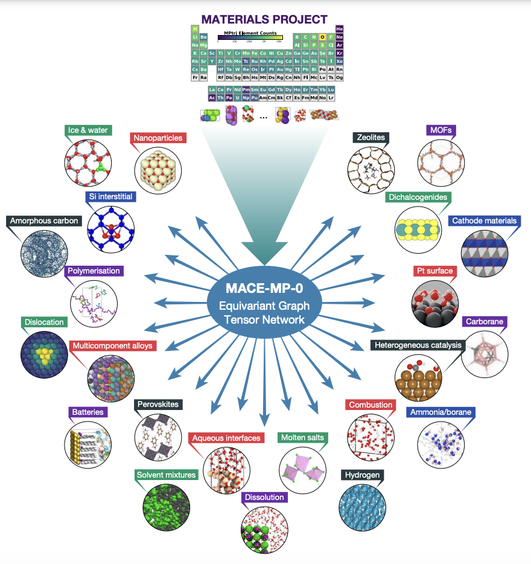
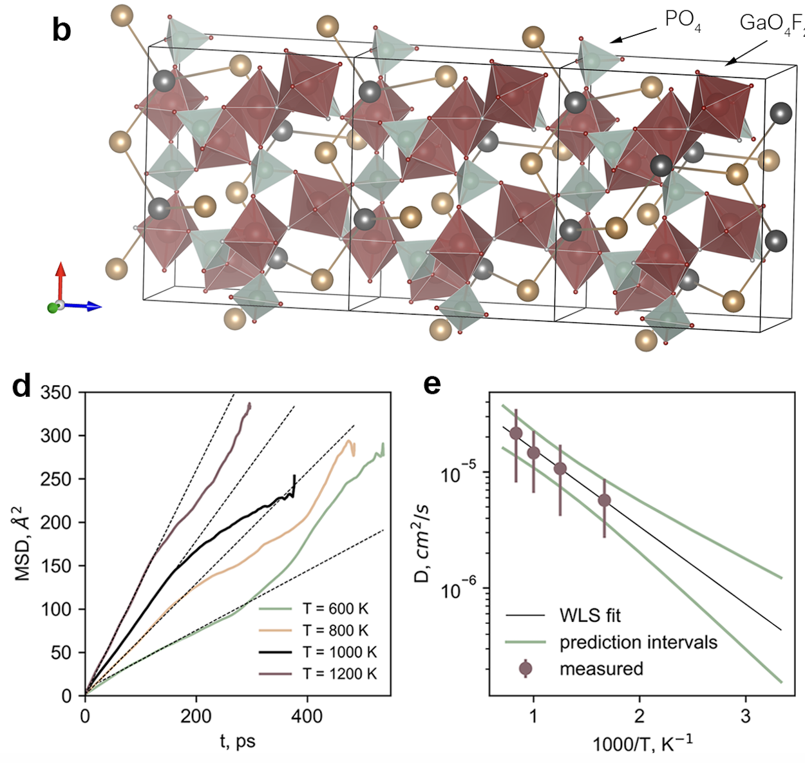

## Lecture #8: Machine learning for molecular simulation

<footer>Slides by <a href="https://github.com/dembart">Artem Dembitskiy</a></footer>

---

### Previously on

- Encoding atomic structures for ML 
- Crystal graph neural networks

---

### Goals/Agenda

- Molecular dynamics basics
- Interatomic potentials
  - Energy, forces, stresses

- Machine learning interatomic potentials
  - Generating data
  - Fitting potential
  - Active learning
  - Validating the potential

- Foundational models for atomistic modeling

---

### Zero-temperature density functional theory calculations

- Static density fuctional theory calculations yields the thermodynamic properties at 0 K

- We iteratively optimize the geometry until the forces/energy converge

However
- Sometimes the configurational space is enormous 
  - conformers
- Sometimes thermal effects matter
  - phase transition
- Sometimes the rate of some events needs to be estimated
  - diffusion

**How to deal with these?**

<footer>Image
 <a href="https://upload.wikimedia.org/wikipedia/commons/thumb/2/22/Butane_conformations_and_relative_energies.svg/2560px-Butane_conformations_and_relative_energies.svg.png">source </a></footer>

---

### Molecular dynamics 

...is used to study the dynamics of atomic systems

- i.e. evolution at finite temperature

<footer>Image
 <a href="https://www.ks.uiuc.edu/Research/folding/">source </a></footer>

---

### Basic MD princinples

The net force acting on particle is directly proportional to its acceleration 

$
F_i = m_i \frac{\partial^2r_i}{\partial t^2}
$

at the same time:

$
F_i = -\frac{\partial V}{\partial r_i}
$, where $V$ is the potential energy (surface), $V(R)$, where $R=R(r_1, .., r_i)$ - is the state of the system, i.e. its geometry

<footer>Molecular Dynamics:
 <a href="https://www.compchems.com/molecular-dynamics-equations-of-motion/#md-algorithm-summary">Equations of motion</a></footer>

---

### Integrating Newton’s laws of motion 

We want to find $r_i(t)$, i.e. $R(t)$

We **can't** find it analytically for more than two interacting particles (see [three-body problem](https://en.wikipedia.org/wiki/Three-body_problem))

We **can** solve it numerically

---

### Finite difference method

The shape of $V(R)$ is known at the given moment $t$

The acceleration for each particle is given by

$a_i = \frac{F_i}{m_i} = -\frac{1}{m_i} \frac{\partial V}{\partial r_i}
$ eq. $(1)$

0) Initialize velocities

1) Select a small timestep $\delta t$ (it should correctly describe the changes in your sysrtem)

2) Calculate forces

3) Integrate eq. $(1)$ within  $(t, t + \delta t)$ window to get velocities $\boldsymbol{v_i}(t + \delta t)$ 

4) Update coordinates using calculated velocities for each particle 
$\boldsymbol{r_i} = \boldsymbol{r_i} + \delta t \boldsymbol{v_i}$

5) Repeat 2-4 steps N times

6) Analyse the discrete trajectory obtained

---

### Ab initio MD (AIMD)

Pros:

- "Exact"
- Yields electronic structure

Cons:
- QM approches can be applied to small systems (~100 atoms)
  - very expensive
- i.e. length scale ~1 nm
  - poor statistics
  - artificial size-effects (for PBC)
- time scales ~ 0.1 ns
  - poor statistics

---

### Classical MD

Some "empirical" functional relationship $f(W, R) = V(R)$, $W$ - parameters of the model

Pros:
- Large scale simulations (thousands of atoms)
- Long time simulations (~10 nanoseconds)
- 10$^{2}$-10$^{8}$-fold speed up compared to DFT
- Interpretable

Cons:
- No electronic structure
- Approximate - may fail
- Difficult to fit
- The shape of $f$ depends on the cheimcal bonding 
  - no universal approach
---
### Example

Lennard-Jones pair potential 

---

### Machine learning assited MD

Some ML model $f(W, R) = V(R)$, $W$ - parameters of the model

Pros:
- Large scale simulations (thousands of atoms)
- Long time simulations (~10 nanoseconds)
- 10$^{2}$-10$^{?}$-fold speed up compared to DFT
- Easy to fit/refit
- Universal approach to any chemical bonding
- Provides energies/forces with a DFT accuracy

Cons:
- No electronic structure
- Approximate - may fail
- Slower compared to classical MD, Difficult to interprete compared to classical MD

---

### Example

- Moment-tensor [potentials](https://arxiv.org/pdf/1512.06054) developed by prof. Shapeev at Skoltech

- The NequIP network architecture (at the picture)

<footer>E(3)-equivariant graph neural networks for 
 <a href="https://www.nature.com/articles/s41467-022-29939-5">data-efficient and accurate interatomic potentials</a></footer>

---

### Energy calculations with interatomic potentials

- the potential energy is calculated as the sum of atomic potential energies

${E}_{pot}=\mathop{\sum}\limits_{i\in {N}_{atoms}}{E}_{i,atomic}$

- forces are calculated as follows

${\vec{F}}_{i}=-{\nabla }_{i}{E}_{pot}$

---

### Fitting (training) the potentials

We run AIMD at elevated temperatures to sample atomic configurations
- **for a given chemical system**

**The dataset**:
Geometries: {$R_n$}
Energies: {$E_n(R_n)$}
Forces: {$F_{i, \alpha}(R_n)$}

**Loss function**

${{{{{{{\mathcal{L}}}}}}}}={\lambda }_{E}| | \hat{E}-E| {| }^{2}+{\lambda }_{F}\frac{1}{3N}\mathop{\sum }\limits_{i=1}^{N}\mathop{\sum }\limits_{\alpha =1}^{3}\left|\left| -\frac{\partial \hat{E}}{\partial {r}_{i,\alpha }}-{F}_{i,\alpha }\right| \right| ^{2}$, where the hat symbol (e.g., $\hat{E}$) denotes predictions

---

### After the fitting, the potential is deployed to perform large scale MD simulations

___

### Universal interatomic potentials

- Once trained on large datasets covering a wide chemical and structural configuration space 
  - For example, the Materials Project dataset
- Can be applied to the unknown systems
  - To perform downstream tasks

Pros:
  - Works out of the box
  - Can be refitted (finetuned) with a small amount of data

Cons:
  - Universality is debatable. Should be carefully validated before using
  - A lot of weights -> slower compared to ML potentials developed for a specific system

---

### Example
MACE-MP-0 graph neural network

<footer>
A foundation model for atomistic 
 <a href="https://arxiv.org/pdf/2401.00096">materials chemistry</a></footer>

---
## Take home message 

- MD is used to study the evolution of atomic systems at the given conditions
- Machine learning interatomic potentials (MLIPs) are used to accelerate simulations
  - can be easily fitted
- Universal MLIPs are trained on large dataset
  -  to solve downstream tasks for a wide range of chemical systems

---

### Ionic conductivity (for the seminar)

"is a measure of a substance's tendency towards ionic conduction. Ionic conduction is the movement of ions. The phenomenon is observed in solids and solutions. Ionic conduction is one mechanism of current." ([wiki](https://en.wikipedia.org/wiki/Ionic_conductivity_(solid_state)))

---
### Formulas (for the seminar)

#### MSD vs. time

$MSD(\tau) = 6D\tau$

#### Arrhenius equation
$D = D_0\exp(-E_a/kT)$

#### Ionic conductivity

$\sigma = \frac{\rho e^2 D}{kT}$
- $\rho$ is the diffusing particle density (number of ions N,  per volume, V, of the system)
- $e$ is the charge of electron
- $D$ is the diffusivity
- $k$ - Boltzman’s constant

---
# Thank you for your attention!

