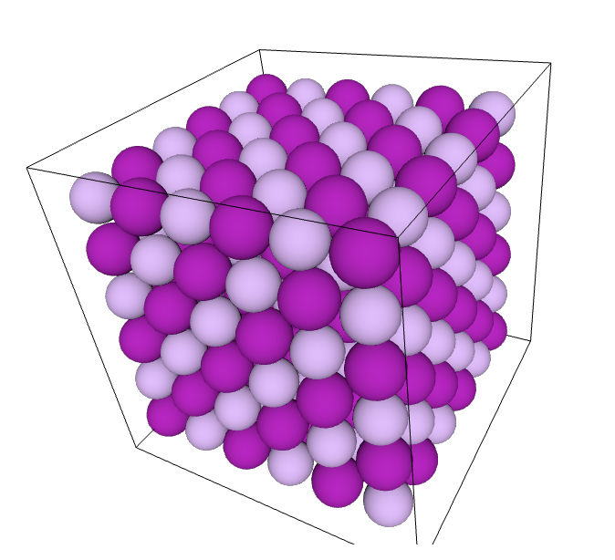
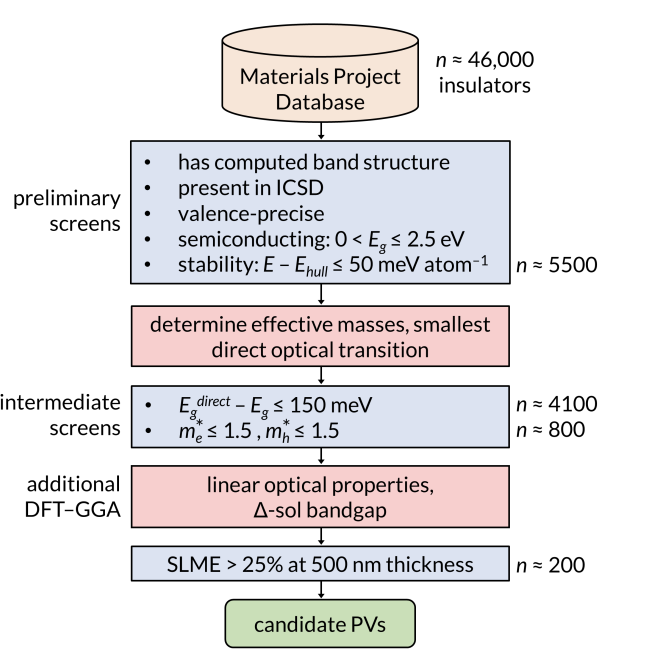

## Lecture #9: Course wrap up

<footer>Slides by <a href="https://github.com/dembart">Artem Dembitskiy</a></footer>

---
## Materials science
- studies the relationship between the structure and properties of materials

- develops new materials to enable new technolgies, which improve our lives (hopefully)


<footer> Image <a href="https://sustainable-nano.com/wp-content/uploads/2014/02/5-diamond-vs-graphite-structures.jpg">source</a> </footer>

---
### Tasks that materials science solves:

- Design
- Imrove
- Understand reasons of a failure
- ...


<footer> Image <a href="https://www.viridiansolar.co.uk/assets/images/all-about-solar/pv-cell-efficiency-record.jpg">source</a> </footer>


---
### Trial-and-error


---
### Materirals informatics


"... is a field of study that applies the principles of informatics and data science to materials science and engineering to improve the understanding, use, selection, development, and discovery of materials." ([wiki](https://en.wikipedia.org/wiki/Materials_informatics))


---
### Python tools for atomistic modeling

<style scoped>section{font-size:20px;}</style>




```python
from ase.io import read, write
from ase.visualize import view
from ase.build import make_supercell

atoms = read('data/LiI.cif')
sc = make_supercell(atoms,
  [[3, 0, 0 ],
   [0, 3, 0],
   [0, 0, 3]]
   )
view(sc, viewer='x3d')
write('data/LiI_3x3x3.cif', sc)

```
Automation:
- saves your time
- gives you the opportunity (tools) to realize your ideas
- reduces number of mistakes (typos) made

---

## Data
**Why use someone else's data?**

<style scoped>section{font-size:22px;}</style>

- guide to your research objective
- reference
- baseline
- insight
- explanation
- enrichment
- time


<footer>Image<a href="https://library.ethz.ch/en/researching-and-publishing/data-management-and-policies/research-data-management/research-data-life-cycle.html"> source</a> </footer>


---

#### The MP's data usage example
<style scoped>section{font-size:21px;}</style>



Screening inorganic PVs

- Screened database
- Identified candidates
- Calculated properties of interest for ~800 compounds
- Shared the data


<footer>Candidate Inorganic Photovoltaic Materials
from<a href="https://escholarship.org/content/qt0pd1p12v/qt0pd1p12v_noSplash_5e3280ea751c383fe52802f7151a0d0f.pdf"> Electronic Structure-Based Optical
Absorption and Charge Transport Proxies</a> </footer>

---
### The FAIR Guiding principles

... for [scientific data management and stewardship](https://www.nature.com/articles/sdata201618)


<style scoped>section{font-size:25px;}</style>


<footer>Image<a href="https://www.nlm.nih.gov/oet/ed/cde/tutorial/img/06bCDE.png"> source</a> </footer>

---
### The data science workflow


<footer>From CS 109a: Data Science,
Effective Exploratory Data
Analysis and Visualization by Pavlos Protopapas & Kevin Rader<a href="https://harvard-iacs.github.io/2018-CS109A/lectures/lecture-3/presentation/lecture3.pdf"> slide #2</a></footer>


---

### Why is visual inspection of data important?

- Same descriptive statistics
- Very different distributions


https://en.wikipedia.org/wiki/Anscombe%27s_quartet


---

### Exploratory data analysis pipeline

- Build data 
- Clean data
- Explore global features
- Explore group features

---
### Visulaization goals

<style scoped>section{font-size:24px;}</style>


Communicate (Explanatory)
- Present data and ideas
- Explain and inform
- Provide evidence and support
- Influence and persuade

Analyze (Exploratory)
- Explore the data
- Assess a situation
- Determine how to proceed
- Decide what to do


<footer> From CS 109a: Data Science,
Effective Exploratory Data
Analysis and Visualization by Pavlos Protopapas & Kevin Rader<a href="https://harvard-iacs.github.io/2018-CS109A/lectures/lecture-3/presentation/lecture3.pdf"> slide #23</a></footer>

---
### Explore
<style scoped>section{font-size:24px;}</style>


<footer>Order–Disorder Phase Transition and Ionic Conductivity in a<a href="https://pubs.acs.org/doi/10.1021/acsami.3c07242"> Li2B12H12 Solid Electrolyte</a></footer>

---


<style scoped>section{font-size:24px;}</style>
### Lie factor


---

# Don't use pie charts

Barplots are easier to compare


<footer>Here’s why you should (almost) never use a pie chart <a href="https://theconversation.com/heres-why-you-should-almost-never-use-a-pie-chart-for-your-data-214576"> for your data</a></footer>


---
<style scoped>section{font-size:22px;}</style>

### Use color


Have a look at this page: https://blog.datawrapper.de/colors/

---
<style scoped>section{font-size:22px;}</style>

### But consider a better alternative if possible

- the simpler the better


Have a look at this page: https://blog.datawrapper.de/colors/

---
<style scoped>section{font-size:22px;}</style>
### Classical ML tasks


<footer>Machine Learning for Everyone.<a href="https://vas3k.com/blog/machine_learning/"> In simple words. With real-world examples. Yes, again</a></footer>

---
### Supervised learning

<style scoped>section{font-size:24px;}</style>


"Tries to find the unknown function that connects known inputs to unknown outputs"

<footer>Recent advances and applications of machine learning in <a href="https://www.nature.com/articles/s41524-019-0221-0#Abs1">solid-state materials science </a></footer>

---

Model prediction:
Hardness($d^{-1/2}$ = 5 um$^{-1/2}$)? 

  - input: grain size (known)
  - output: hardness (unkown)


---
<style scoped>section{font-size:25px;}</style>

### Surrogate model for predicting a band gap

  - takes < 1 second to predict the property
  - trained on existing data
  - chemical composition only
  - simple laptop is sufficient

SVR - Support Vector Regression

  


<footer>Predicting the Band Gaps of Inorganic Solids by  <a href="https://pubs.acs.org/doi/10.1021/acs.jpclett.8b00124">Machine Learning</a></footer>

---
### Limitations
- High quality data is required to fit the model
- Accuracy is good for screening stages (RMSE = 0.45 eV)
  - but poor for a more specific tasks

**There is a trade off between speed and accuracy**

---


### Basic supervised  learning workflow


---
### Linear regression

$J(\boldsymbol{w}, b) = \frac{1}{n}\sum{_i^n(\boldsymbol{wx_i}^T + b - y_i)^2}$

### Optimization problem
$J(\boldsymbol{w}, b) \rightarrow{}\underset{w, b}{min}$

---

<style scoped>section{font-size:20px;}</style>

### Hyperparameters?

- During the training (learning) process we find the best **parameters** (weights) of our model

- In addition we have **hyperparameters** which are usually fixed before the actual training process begins

Example:
  - number of trees in random forest, or depth of a decision tree
  - $\lambda$ in Ridge Regression

- They control the learning process itself rather than being learned from the data.


These parameters should be tuned to get better performance of the model


<footer>Hyperparameter <a href="https://www.geeksforgeeks.org/hyperparameter-tuning/"> tuning</a></footer>

---


<style scoped>section{font-size:22px;}</style>

### Features
- In classical ML we use features
- to represent materials in a machine-readable format

- Think of it like a fingerprint


<footer>Machine learning in materials informatics: 
 <a href="https://www.nature.com/articles/s41524-017-0056-5">recent applications and prospects </a></footer>

---

<style scoped>section{font-size:22px;}</style>


### Heirarchy of features
Depending on the resolution we have: 

- Local descriptors
  - site
- Fragment descriptors
  - bond
  - polyhedron
- Global descriptors
  - chemical family
  - structural type
  - density


<footer>Universal fragment descriptors for predicting properties of  <a href="https://www.nature.com/articles/ncomms15679">inorganic crystals </a></footer>


---

### Feature engineering

- Primary descriptors are used to design more complex features

- e.g. by applying set of mathematical operators

See SISSO [paper](https://arxiv.org/abs/1710.03319)


<footer>Machine learning in materials informatics: 
 <a href="https://www.nature.com/articles/s41524-017-0056-5">recent applications and prospects </a></footer>

<style scoped>section{font-size:24px;}</style>

---
<style scoped>section{font-size:24px;}</style>

### Permutation feature importance

**We want to know which features most influence model prediction**

Given dataset {$X, y$}
- Fit the model
- Get scores
- Randomly shuffle one of the feature vectors $x_i$
- Refit model 
- Get scores
- The higher degradation of the model performance the more important the feature


<footer>Permutation importance <a href="https://scikit-learn.org/1.5/modules/permutation_importance.html">in sklearn </a></footer>


---


---


---

<style scoped>section{font-size:22px;}</style>

### The most important properties of an ideal descriptor:

- Invariant with respect to translation of the coordinate system

- Invariant with respect to rotation of the coordinate system

- Invariant with respect to permutation of atomic indices: changing the enumeration of atoms does not affect the target

- Unique: single way to construct a descriptor and the descriptor itself corresponds to a single property

- Continuous: small changes in the atomic structure -> small changes in the descriptor

- Compact

- Computationally cheap

From [DScribe: Library of descriptors for machine learning in materials science](https://www.sciencedirect.com/science/article/pii/S0010465519303042?via%3Dihub) by Lauri Himanen at al. (Computer Physics Communications, 2020)

---

<style scoped>section{font-size:20px;}</style>

### Machine learning for molecular simulations

**Finite difference method**

The shape of $V(R)$ is known at the given moment $t$

The acceleration for each particle is given by

$a_i = \frac{F_i}{m_i} = -\frac{1}{m_i} \frac{\partial V}{\partial r_i}
$ eq. $(1)$

0) Initialize velocities

1) Select a small timestep $\delta t$ (it should correctly describe the changes in your sysrtem)

2) Calculate forces

3) Integrate eq. $(1)$ within  $(t, t + \delta t)$ window to get velocities $\boldsymbol{v_i}(t + \delta t)$ 

4) Update coordinates using calculated velocities for each particle 
$\boldsymbol{r_i} = \boldsymbol{r_i} + \delta t \boldsymbol{v_i}$

5) Repeat 2-4 steps N times

6) Analyse the discrete trajectory obtained

---
<style scoped>section{font-size:24px;}</style>

### Energy calculations with interatomic potentials

- the potential energy is calculated as the sum of atomic potential energies

${E}_{pot}=\mathop{\sum}\limits_{i\in {N}_{atoms}}{E}_{i,atomic}$

- forces are calculated as follows

${\vec{F}}_{i}=-{\nabla }_{i}{E}_{pot}$

---
<style scoped>section{font-size:24px;}</style>

### Fitting (training) the potentials

We run AIMD at elevated temperatures to sample atomic configurations
- **for a given chemical system**

**The dataset**:
Geometries: {$R_n$}
Energies: {$E_n(R_n)$}
Forces: {$F_{i, \alpha}(R_n)$}


**Loss function**


${{{{{{{\mathcal{L}}}}}}}}={\lambda }_{E}| | \hat{E}-E| {| }^{2}+{\lambda }_{F}\frac{1}{3N}\mathop{\sum }\limits_{i=1}^{N}\mathop{\sum }\limits_{\alpha =1}^{3}\left|\left| -\frac{\partial \hat{E}}{\partial {r}_{i,\alpha }}-{F}_{i,\alpha }\right| \right| ^{2}$, where the hat symbol (e.g., $\hat{E}$) denotes predictions

---

<style scoped>section{font-size:24px;}</style>

### Universal interatomic potentials

- Once trained on large datasets covering a wide chemical and structural configuration space 
  - For example, the Materials Project dataset
- Can be applied to the unknown systems
  - To perform downstream tasks

Pros:
  - Works out of the box
  - Can be refitted (finetuned) with a small amount of data

Cons:
  - Universality is debatable. Should be carefully validated before using
  - A lot of weights -> slower compared to ML potentials developed for a specific system


---
<style scoped>section{font-size:24px;}</style>

### Example
MACE-MP-0 graph neural network


<footer>
A foundation model for atomistic 
 <a href="https://arxiv.org/pdf/2401.00096">materials chemistry</a></footer>

---
<style scoped>section{font-size:20px;}</style>

### Take home message

Materials informatics 

- is about effectively using data, statistics, and data science tools for accelerating the trial-and-error process in materials science
- is not always about training ML models

Python (or another programming language) these days
- is support for your development as a successful scientist
- saves your time


Data
 - respect/explore/use/share data

ML
- there is a trade-off between accuracy and speed
- expertise is essential for reliable results
- don't use test data split for model training


