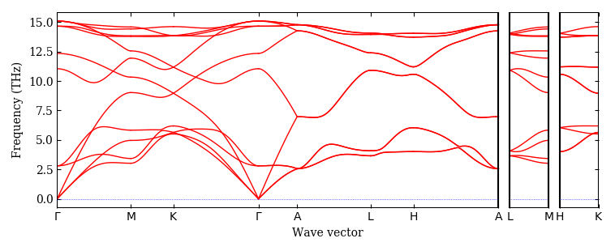
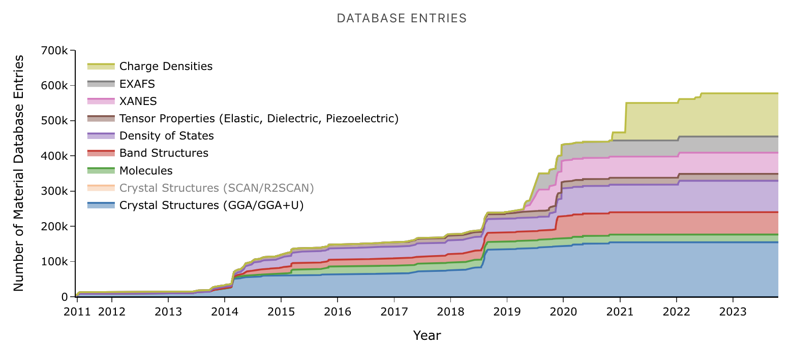
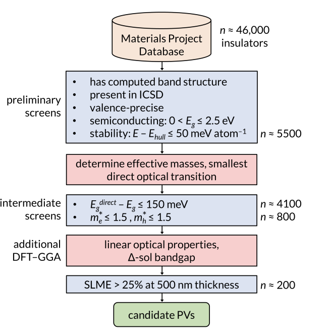

## Lecture #3: Data in materials science

<footer>Slides by <a href="https://github.com/dembart">Artem Dembitskiy</a> </footer>

---
## Previously on
<style scoped>section{font-size:25px;}</style>
  - What is materials informatics
    - Solving materials science problems with **data** science tools
    - HW0 announcement
  - Python for materials modeling
    - Automation vs. Manual
    - Intro to ASE and Pymatgen
---

<style scoped>section{font-size:25px;}</style>

## Goals
- Understand the role of data in materials science
- Provide sources of data
- Introduce the Materials Project database and its API
---
<style scoped>section{font-size:25px;}</style>
## Agenda
- Experimental data
- Computational data
- Why use someone else's data?
- FAIR principles
- The Materials Project
---

## What is data?
<style scoped>section{font-size:25px;}</style>

"Data is a representation of information stored in a systematic way for the purpose of inference, argument or decision making"


From [An Introduction to Data Analysis](https://michael-franke.github.io/intro-data-analysis/index.html) by Michael Franke 


---
### As materials science researchers, we generate a lot of experimental and computational data
<style scoped>section{font-size:20px;}</style>


<footer>Development of vanadium-based polyanion positive electrode active materials for high-voltage  <a href="https://www.nature.com/articles/s41467-022-31768-5">sodium-based batteries</a> </footer>

2-3D Images:
- Electron microscopy images (exp)
- Electron density (exp/comp)

Tabular data
- Eg vs. composition (the last seminar)
- X-ray diffraction pattern (exp/comp)
- Particle size distribution (exp)
- Density of states (comp/exp)
- Energy profile (comp/exp)

Text
- Structure files (exp/comp)
---


### There is a huge amount of materials science data

<style scoped>section{font-size:20px;}</style>

... scattered across various papers, datasets, databases and websites

Github:
- https://github.com/blaiszik/Materials-Databases

Curated databases
- ICSD: https://icsd.products.fiz-karlsruhe.de/
- COD: https://www.crystallography.net/cod/
- CCDC: https://www.ccdc.cam.ac.uk/
- Materials project: https://next-gen.materialsproject.org/
- The Open Quantum Materials Database: http://oqmd.org/
- AFLOW: http://www.aflowlib.org/
- matbench: https://matbench.materialsproject.org/


...and more

---

### Why use someone else's data?

<style scoped>section{font-size:22px;}</style>

- guide to your research objective
- reference
- baseline
- insight
- explanation
- enrichment
- time


<footer>Image<a href="https://library.ethz.ch/en/researching-and-publishing/data-management-and-policies/research-data-management/research-data-life-cycle.html"> source</a> </footer>


---

### What do we expect from the data source?

---
### The FAIR Guiding principles

... for [scientific data management and stewardship](https://www.nature.com/articles/sdata201618)


<style scoped>section{font-size:25px;}</style>


<footer>Image<a href="https://www.nlm.nih.gov/oet/ed/cde/tutorial/img/06bCDE.png"> source</a> </footer>


---

<style scoped>section{font-size:20px;}</style>

**Bad (toy) example** - SuperDuperConductorsDB
- a dataset of superconductivity temperatures of 5,000,000 novel stable crystal structures
- with only transition temperatures and chemical compositions shared
- no crystal structures, no methods provided


website: https://idontsharemydata.com/


---

## These principles should guide your projects (and future research)

---

<style scoped>section{font-size:20px;}</style>

**Ok example** - phonondb
- phonon dispersion curves calculated for ~10,000 crystal structures
- methods, metadata, structure files provided
- hard to handle the data

website: https://github.com/atztogo/phonondb





---


<style scoped>section{font-size:20px;}</style>


**Good example** - matterverse
- ~30,000,000 crystal structures optimized with deep learning potential
- methods, metadata, structure files provided
- has the platform
- REST API is not that good

website: https://matterverse.ai/about


---


<style scoped>section{font-size:20px;}</style>

**Brilliant example** - The Materials Project (MP) database

- ~150,000 crystal structures
- high quality density functional theory calculations
- "provides one of the largest publicly available data set of computed materials properties"
- methods, metadata, structure files provided
- handy platform
- good REST API

**We will learn how to use it during today's seminar**




website: https://next-gen.materialsproject.org/

---
## The MP data access - simple

- you need your API key
- and python

Each material in the database has an identifier (mp_id).


```python
from mp_api.client import MPRester

with MPRester(api_key="your_api_key_here") as mpr:
    # retrieve SummaryDocs for a list of materials
    docs = mpr.summary.search(material_ids=["mp-149", "mp-13"])
```
---
#### The MP's data usage example
<style scoped>section{font-size:21px;}</style>



Screening inorganic PVs

- Screened database
- Identified candidates
- Calculated properties of interest for ~800 compounds
- Shared the data


<footer>Candidate Inorganic Photovoltaic Materials
from<a href="https://escholarship.org/content/qt0pd1p12v/qt0pd1p12v_noSplash_5e3280ea751c383fe52802f7151a0d0f.pdf"> Electronic Structure-Based Optical
Absorption and Charge Transport Proxies</a> </footer>

---
### A few words about Density Functional Theory (DFT) before the MP database seminar

<style scoped>section{font-size:21px;}</style>


- Quantum-Mechanical approach to calculate the electronic structure (ground state electron density) of materials

- The most popular method in materials modelling


- Has high predictive power, but:

  - scales as O(N^3), N - number of electrons in a system

  - requires a lot of compute

- Out of the scope of this course

- Consider Computational Chemistry and Materials Modeling course (MA060008) for learning fundamentals of DFT 
---

### Take home message
- There are many (open) sources of materials data
- Using someone else's data can help guide or improve your research
- Consider the FAIR principles for sharing your own data
---


### Resources

https://github.com/sedaoturak/data-resources-for-materials-science?tab=readme-ov-file

https://github.com/sp8rks/MaterialsInformatics/blob/main/course_notes/5.%20Materials%20Data%20Repositories.pdf

https://matbench.materialsproject.org/


